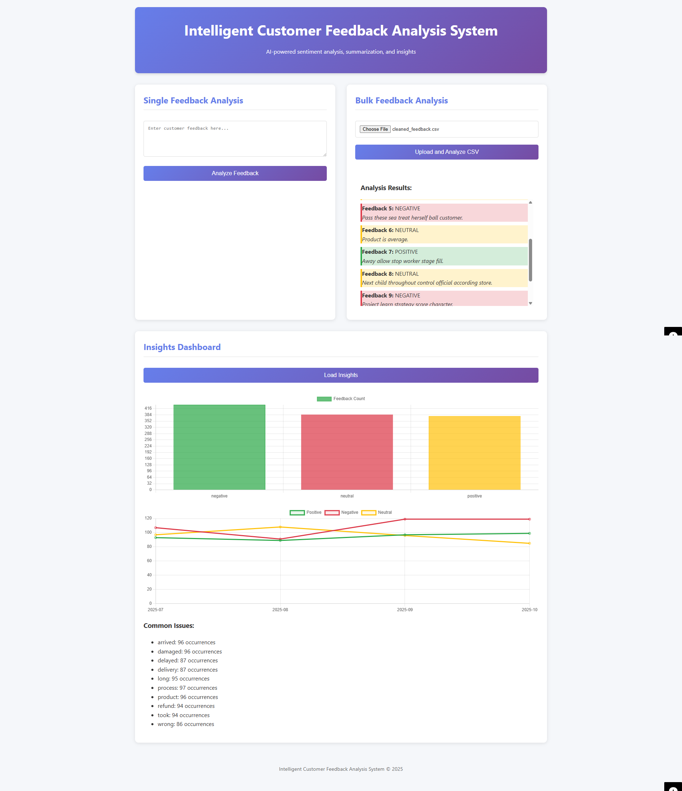

# Intelligent Customer Feedback Analysis System

This project implements an AI-based system that can analyze, summarize, and predict customer sentiment from feedback data.

## Project Structure

*   `data_preprocessing.py` - Data handling and cleaning (Part 1)
*   `sentiment_classification.py` - Sentiment classification model (Part 2)
*   `text_summarization.py` - Text summarization (Part 3)
*   `predictive_insights.py` - Predictive insight generation (Part 4)
*   `app.py` - Flask web application (Part 5)
*   `templates/` - HTML templates for the web app
*   `cleaned_feedback.csv` - Generated cleaned dataset
*   `sentiment_model_svm.pkl` - Trained sentiment model
*   `summarized_feedback.csv` - Feedback with generated summaries

## Installation

1.  Install required packages:
    ```bash
    pip install -r requirements.txt
    ```
2.  For the web application, also install:
    ```bash
    pip install -r requirements_app.txt
    ```

## Usage

### Part 1: Data Handling
```bash
python data_preprocessing.py
```

### Part 2: Sentiment Classification
```bash
python sentiment_classification.py
```

### Part 3: Text Summarization
```bash
python text_summarization.py
```

### Part 4: Predictive Insights
```bash
python predictive_insights.py
```

### Part 5: Web Application
```bash
python app.py
```
Then open `http://localhost:5000` in your browser.

### Output


## Features

1.  **Data Handling**: Generates and cleans customer feedback data
2.  **Sentiment Analysis**: Classifies feedback as positive, negative, or neutral
3.  **Text Summarization**: Creates short and detailed summaries of feedback
4.  **Predictive Insights**: Identifies recurring issues and predicts satisfaction trends
5.  **Web Interface**: User-friendly web application for analysis and visualization

## Model Information

The system uses a TF-IDF + SVM model for sentiment classification, which is more lightweight than transformer-based models while still providing good accuracy.
